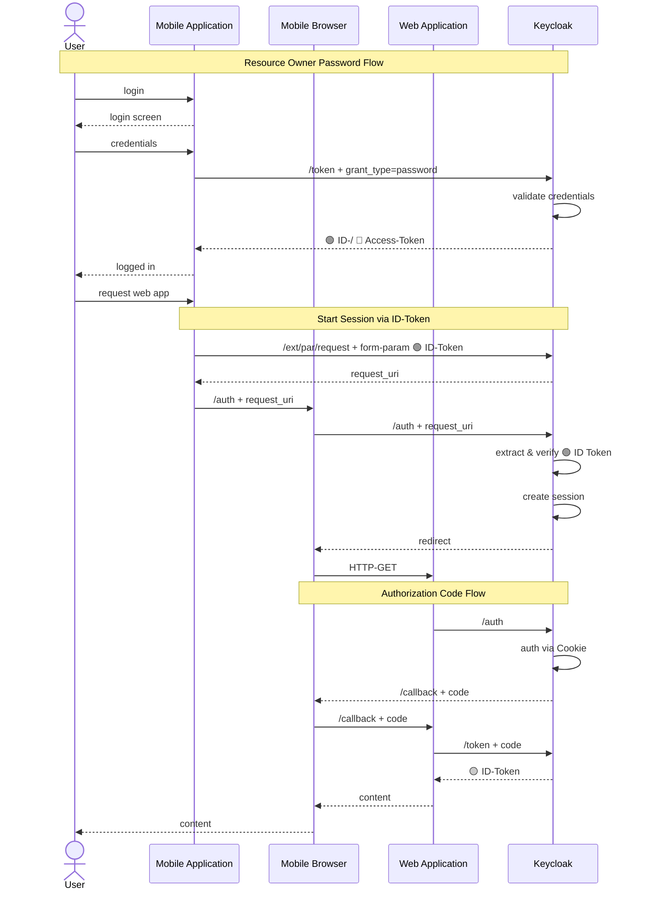
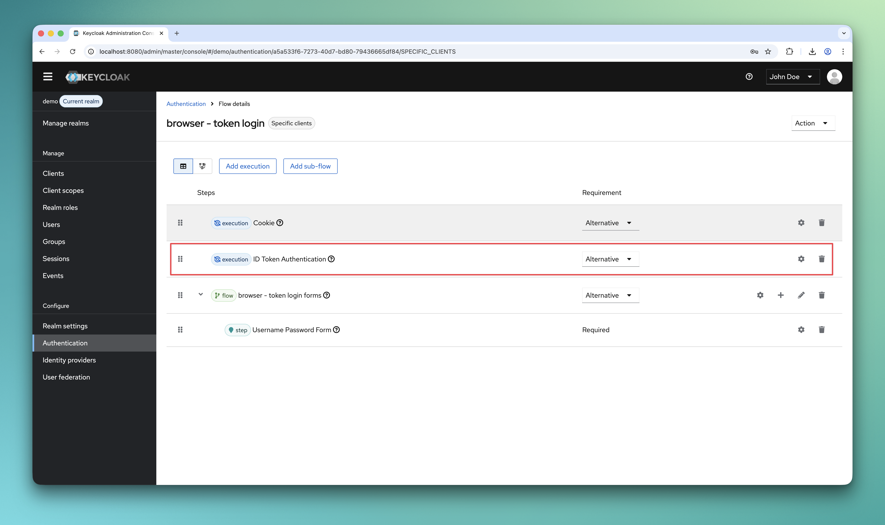
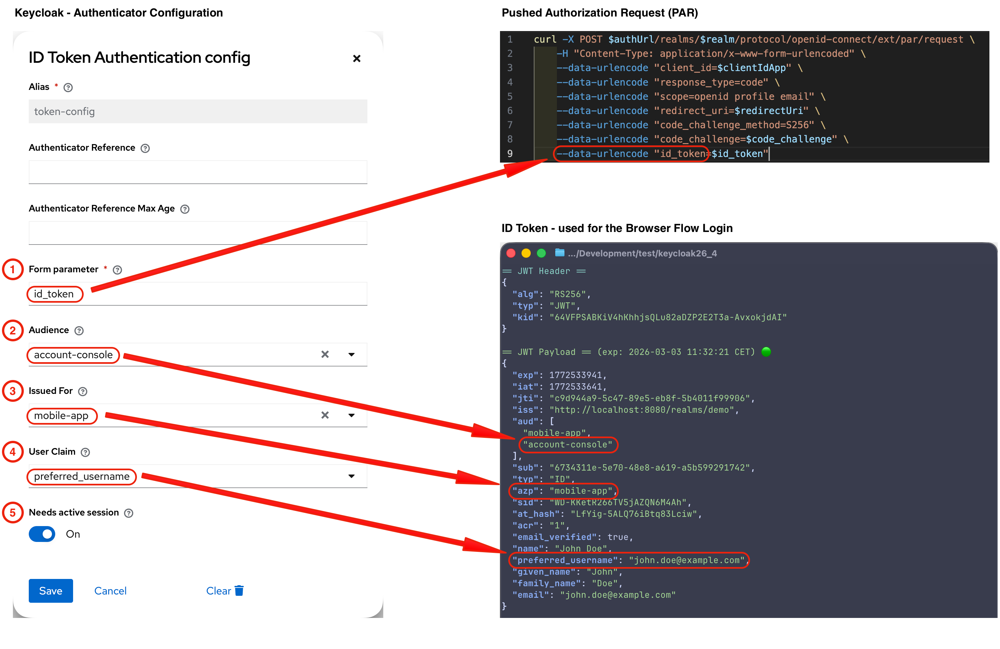

# Login via ID Token

This is a simple Keycloak aut henticator that enables users to log in using ID tokens.


[](https://codescene.io/projects/25589)

## What is it good for?

In my customer projects, I often encountered the challenge that single sign-on did not work due to a missing session/cookie in the browser.
This situation can arise if
- the application uses the "Resource Owner Password Credentials Grant" flow **or**
- the mobile browser does not permanently store the cookie for the mobile app

## How does it work?

The authenticator expects an ID token in the client notes, which can be transmitted via a pushed authorization request (PAR)
in an additional request. If such a token is available, it is validated and,
if validation is successful, the user from the ID token is set in the authentication context.

Here is an example of one of the use cases (public target client):



## How to install?

Download a release (*.jar file) that works with your Keycloak version from the [list of releases](https://github.com/mkunz-it/keycloak-id-token-auth/releases).
Follow the below instructions depending on your distribution and runtime environment.

### Standalone (without container)

Copy the jar to the `providers` folder and execute the following command:

```shell
${kc.home.dir}/bin/kc.sh build
```

### Container image (Docker)

For Docker-based setups mount or copy the jar to `/opt/keycloak/providers`.

If you are using RedHat SSO instead of Keycloak open source, mount or copy the jar to `/opt/eap/providers/`.

You may want to check [docker-compose.yml](docker-compose.yml) as an example.

This project also includes a list of executable shell scripts that work with docker-compose.yml.

### Maven/Gradle

Packages are being released to GitHub Packages. You find the coordinates [here](https://github.com/mkunz-it/keycloak-id-token-auth/packages/779937/versions)!

It may happen that I remove older packages without prior notice, because the storage is limited on the free tier.

## How to configure?

The following section shows the configuration of the authenticator in a simplified browser flow.

### Browser flow

This authenticator can be used as an alternative to the authenticator cookie, Kerberos, etc.



The configuration of this authenticator is as follows



| Field                    | Description                                                                                                                                        | Example              |
|--------------------------|----------------------------------------------------------------------------------------------------------------------------------------------------|----------------------|
| (1) Form parameter       | Specifies which form parameter contains the ID Token                                                                                               | `id_token`           |
| (2) Audience             | Specifies which target audience (client_id) must be included in the ID token                                                                       | `account-console`    |
| (3) Issued For           | Specifies which client_id must be set as "issued for" in the ID token                                                                              | `mobile-app `        |
| (4) User Claim           | Specifies which claim from the ID Token should be used to identify the user in Keycloak<br/> Possible values: `sub`, `email`, `preferred_username` | `preferred_username` |
| (5) Needs active session | If this option is set to `On`, there must be an existing and active session for the client specified in the `Issued For` field                     | `On`                 |

### Audience

There are two ways to add the target client as an `audience` into the ID token so that it can be checked later by the authenticator.

1. You use a token mapper on the start client, which writes the `audience` of the target client to the ID token.
2. You use the standard token exchange, which exchanges the ID token of the start client for that of the target client (https://www.keycloak.org/securing-apps/token-exchange#_standard-token-exchange).

## Security considerations

- Public clients should always have PKCE enabled to prevent **authorization code interception**
- If possible, all checks in the authenticator should be activated to ensure maximum security
- Real clients should **never** share `Valid redirect URIs` with each other
- If the target client is a confidential client, then a "proxy client" should always be used for configuring the `Valid redirect URIs` and the PAR/Auth call

## Common Use Cases

To make your life easier, I have described four possible use cases and their procedures

| Use Case                                              | confidential target client | Audience Mapper | Token Exchange | Docu                                                                                                                   | Example Shell-Script                    |
|-------------------------------------------------------|----------------------------|-----------------|----------------|------------------------------------------------------------------------------------------------------------------------|-----------------------------------------|
| UC_1 - Public target client                           | false                      | true            | false          | [uc_1_public_target_client.md](docu/uc_1_public_target_client.md)                                                      | [uc_1_example.sh](test/uc_1_example.sh) |
| UC_2 - Public target client with Token Exchange       | false                      | false           | true           | [uc_2_public_target_client_token_exchange.md](docu/uc_2_public_target_client_token_exchange.md)                        | [uc_2_example.sh](test/uc_2_example.sh) |
| UC_3 - Confidential target client                     | true                       | true            | false          | [uc_3_confidential_target_client.md](docu/uc_3_confidential_target_client.md)                                          | [uc_3_example.sh](test/uc_3_example.sh) |
| UC_4 - Confidential target client with Token Exchange | true                       | false           | true           | [uc_4_confidential_target_client_with_token_exchange.md](docu/uc_4_confidential_target_client_with_token_exchange.md)  | [uc_4_example.sh](test/uc_4_example.sh) |

All use cases can be run locally with the corresponding shell script and the provided [docker-compose.yml](docker-compose.yml) file.