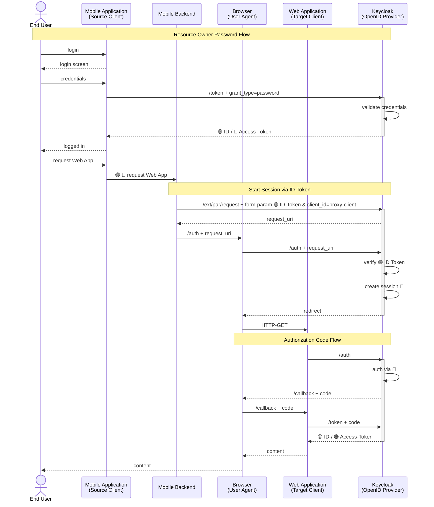
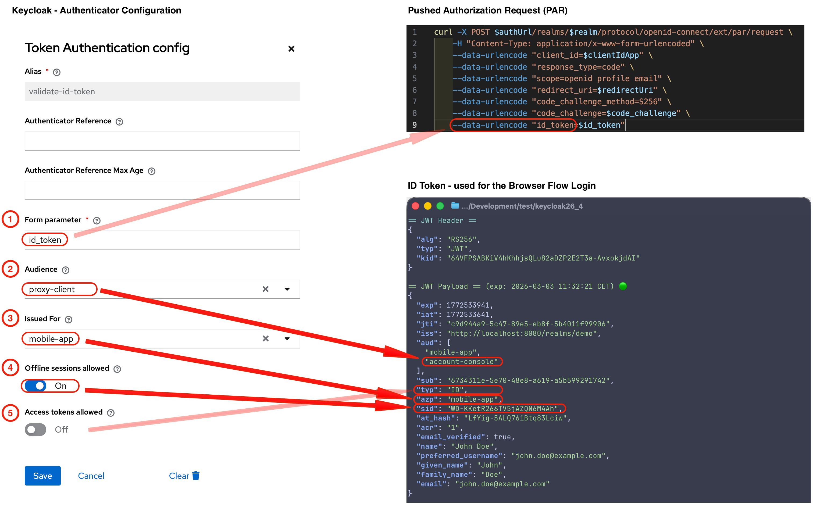
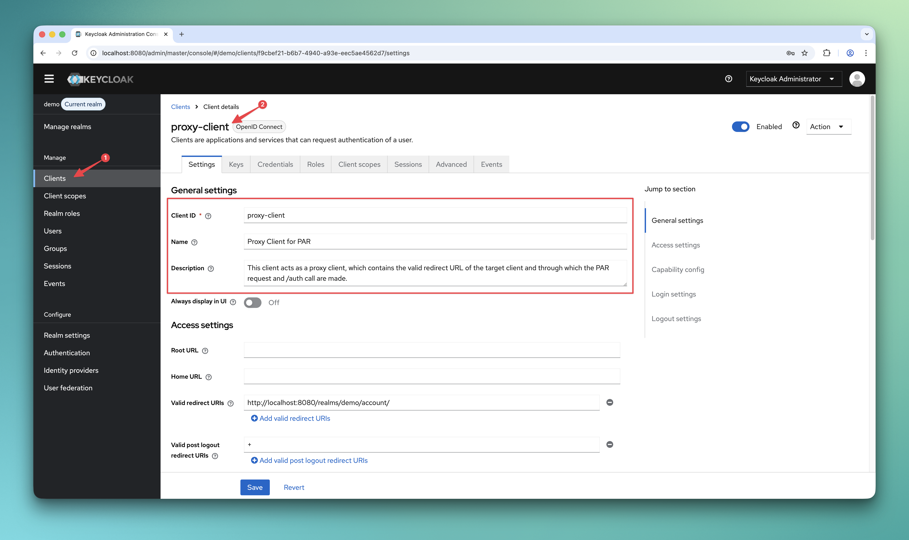
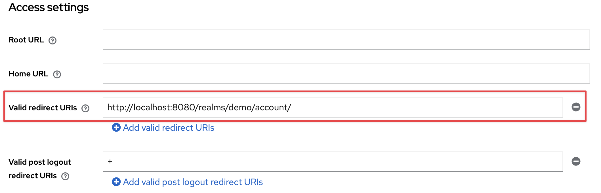
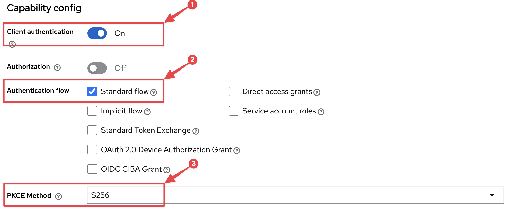
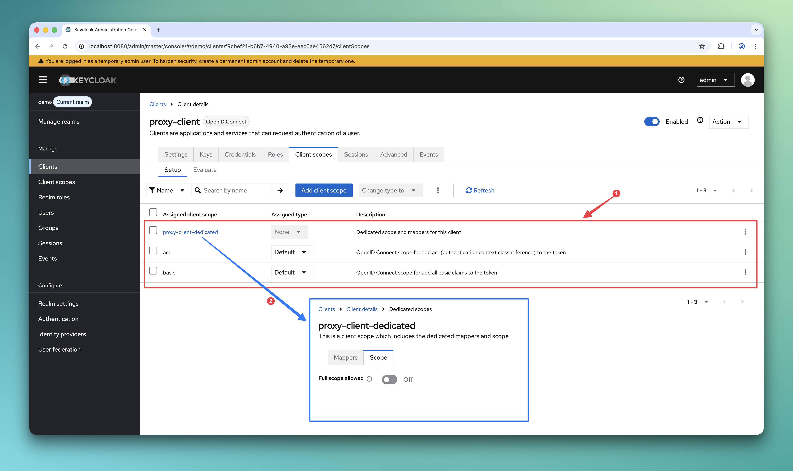
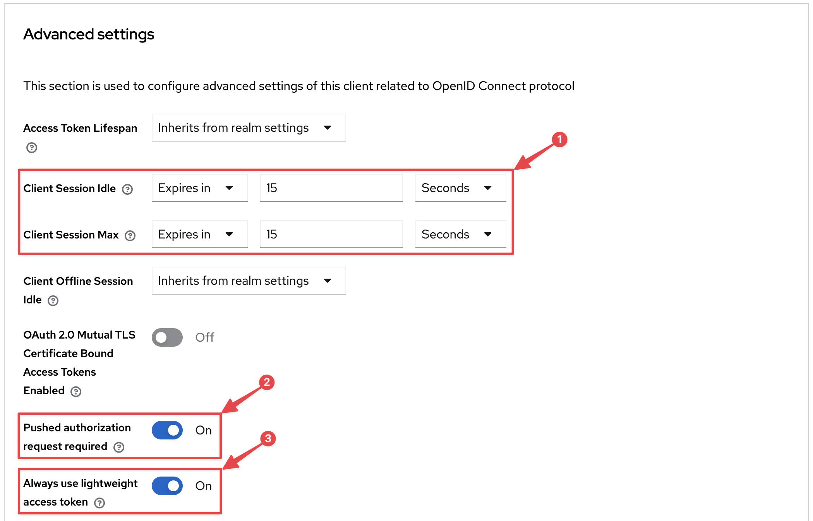
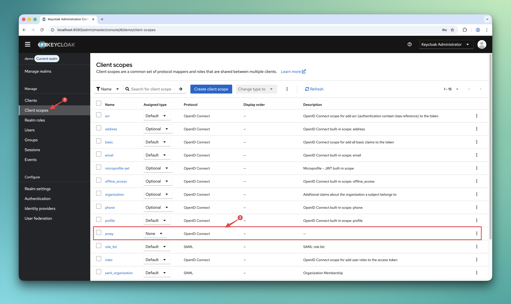
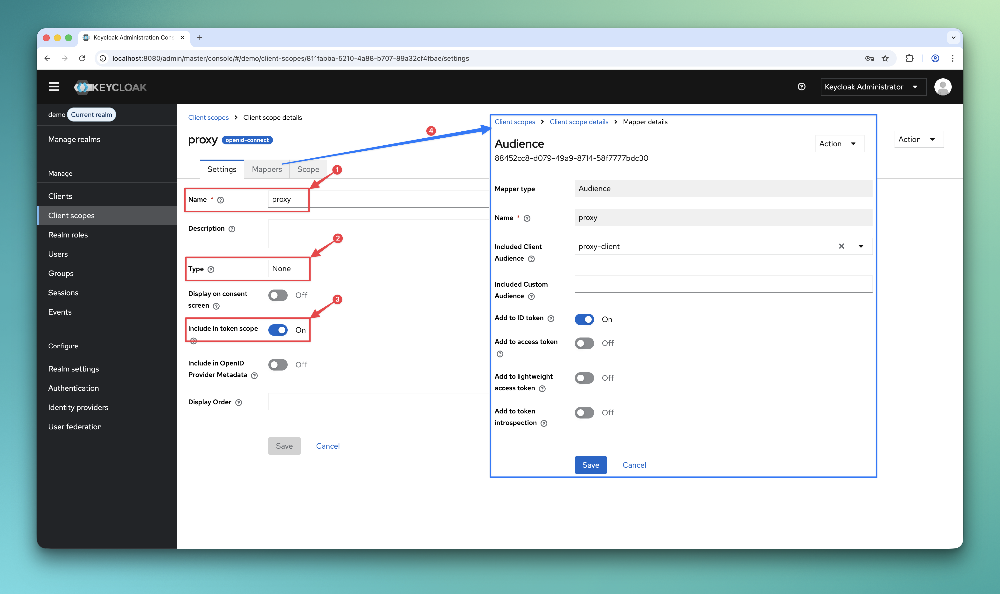
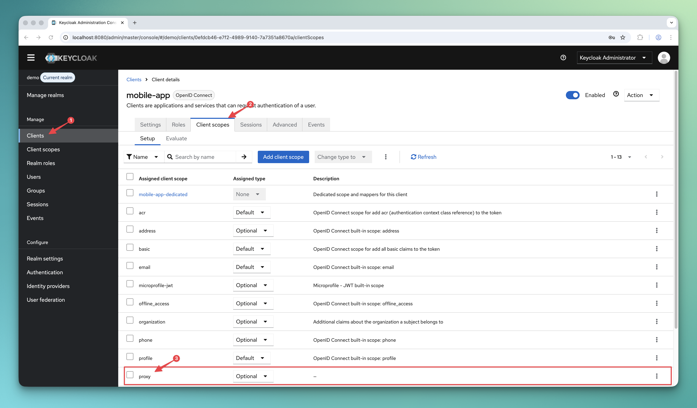

# Login via JWT Token

This is a simple Keycloak authenticator that enables users to log in using tokens.


[](https://codescene.io/projects/25589)

## What is it good for?

In my customer projects, I often encountered the challenge that single sign-on did not work due to a missing session/cookie in the browser for mobile apps.
This situation can arise if
- the application uses the "Resource Owner Password Credentials Grant" flow **or**
- the mobile browser does not permanently store the cookie for the mobile app

## How does it work?

The authenticator expects an ID- or Access token in the client notes, which can be transmitted via a pushed authorization request (PAR)
in an additional request. If such a token is available, it is validated and,
if validation is successful, the user from the token is set in the authentication context.

Here is an example of one of the use cases (public target client):



## How to install?

Download a release (*.jar file) that works with your Keycloak version from the [list of releases](https://github.com/mkunz-it/keycloak-token-auth/releases).
Follow the below instructions depending on your distribution and runtime environment.

### Standalone (without container)

Copy the jar to the `providers` folder and execute the following command:

```shell
${kc.home.dir}/bin/kc.sh build
```

### Container image (Docker)

For Docker-based setups mount or copy the jar to `/opt/keycloak/providers`.

If you are using RedHat SSO instead of Keycloak open source, mount or copy the jar to `/opt/eap/providers/`.

You may want to check [docker-compose.yml](docker-compose.yml) as an example.

This project also includes a executable shell script [login_example.sh](test/login_example.sh) that works together with docker-compose.yml.
To get an idea of what the script does, you can take a look at the following: [Overview.md](test/Overview.md)

### Maven/Gradle

Packages are being released to GitHub Packages. You find the coordinates [here](https://github.com/mkunz-it/keycloak-token-auth/packages/779937/versions)!

It may happen that I remove older packages without prior notice, because the storage is limited on the free tier.

## How to configure in Keycloak?

### Browser flow

This authenticator can be used as an alternative to the authenticator cookie, Kerberos, etc.
We need to create a custom browser flow, which will be later assigned to our `proxy-client`.


The configuration of this authenticator is as follows



| Field                        | Description                                                                                                                  | Default    |
|------------------------------|------------------------------------------------------------------------------------------------------------------------------|------------|
| (1) Form parameter           | Specifies which form parameter contains the ID Token                                                                         | `id_token` |
| (2) Audience                 | Specifies which target audience (client_id) must be included in the ID token                                                 | -          |
| (3) Issued For               | Specifies which client_id must be set as "issued for" in the ID token (sourceClient)                                         | -          |
| (4) Offline sessions allowed | Defines whether offline sessions are also permitted for searching for the user session (On = permitted, Off = not permitted) | `On`       |
| (5) Access tokens allowed    | Specifies whether access tokens are also permitted for login (support of `"typ": "Bearer"`).                                 | `Off`      |

### Proxy Client

To avoid having to maintain the valid redirect URIs on the `source client`, we use a confidential OIDC `proxy-client` for the Pushed Authorization Request (PAR) call.

#### Step 1: Create a new confidential OIDC client



#### Step 2: Configure all Valid redirect URIs

Configure all permitted redirect URIs for the `target clients`. In our case, this is the Keycloak console.



#### Step 3: Protect the client

Set the client to **confidential** and enable PKCE (PKCE is optional but recommended).
Only the ‘Standard Flow’ needs to be enabled to allow the ‘Authorisation Code Flow’



#### Step 4: Reduce scopes

This `proxy client` only requires the ‘openid’ scope, so we will restrict the scopes as follows.
"Full scope allowed" option on the dedicated scope should also be disabled.



#### Step 5: Reduce Session and force PAR

PAR should be mandatory for the `proxy client`, and the session duration can be set to a very short time (e.g. 15 seconds).



**Optional:** We can also enable the ‘Always use lightweight access tokens’ option, but in normal use cases we will never receive a token for this client.

#### Step 6: Assign custom browser flow

Finally, we need to map our customer browser flow to the `proxy client`.

### Client Scope

To ensure that the correct audience is set for the `proxy client` in the token, we create a dedicated client scope with name `proxy` for this use case.



Here is the detailed configuration



### Add Scope to the source client

Once we have created the client scope `proxy`, it must be assigned to the `source client`. In our example, this is the client "**mobile-app**".
Abhängig davon, we der Scope angefragt wird, kann dieser als "Optional" oder "Default" konfiguriert werden.
In this configuration, the scope must always be requested by the client.



## Security considerations

- The `proxy-client`
  - should always have PKCE enabled to prevent **authorization code interception**
  - must be a **confidential** client
  - be the **only place** to configure valid redirect URI's for target clients using ID Token login
  - has a dedicated custom browser flow with the securely configured Token Authenticator
- If possible, all checks in the authenticator should be activated to ensure maximum security
- Where possible, you should use the ID token rather than the access token, as the ID token is used for authentication
- PAR should be run from a backend (e.g. BFF)
