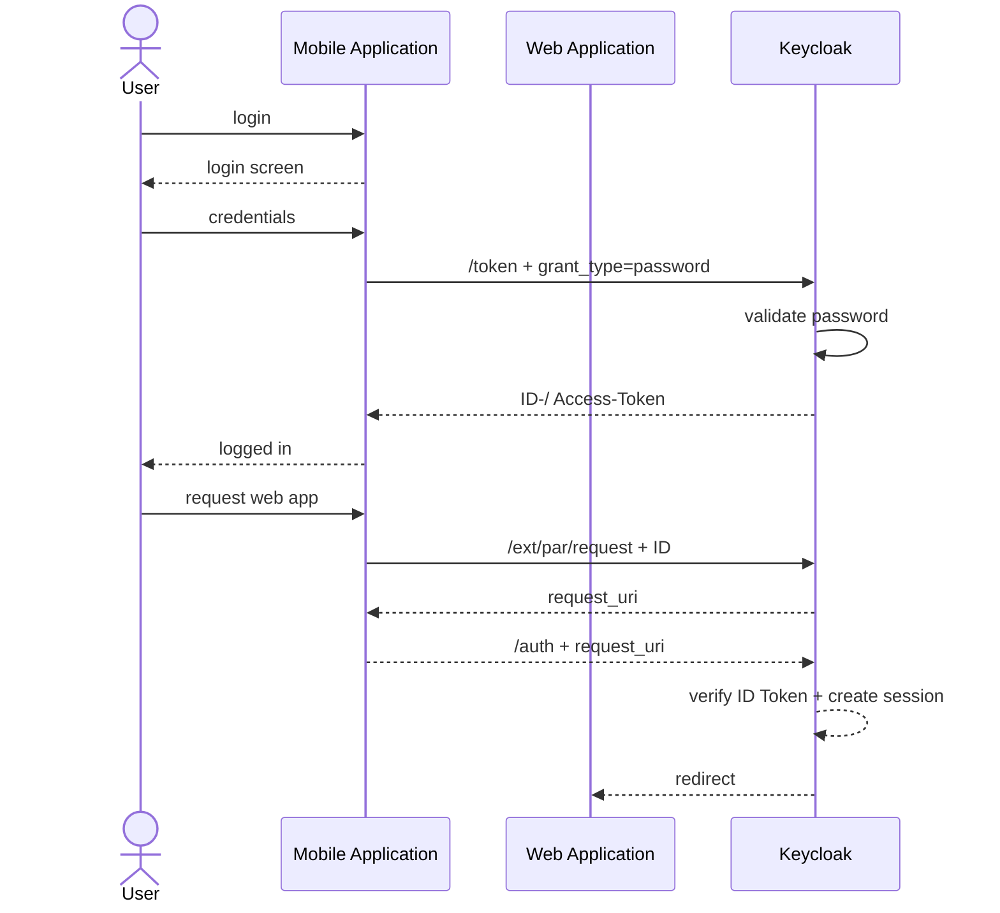

# Login via ID Token

This is a simple Keycloak authenticator that enables users to log in using ID tokens.


[](https://codescene.io/projects/25589)

## What is it good for?

In my customer projects, I often encountered the challenge that single sign-on did not work due to a missing cookie in the browser.
This situation can arise if
- the application uses the "Resource Owner Password Credentials Grant" flow **or**
- the mobile browser does not permanently store the cookie for the mobile app

## How does it work?

The authenticator expects an ID token in the client notes, which can be transmitted via a pushed authorization request (PAR)
in an additional request. If such a token is available, it is validated and,
if validation is successful, the user from the ID token is set in the authentication context.


Here is an example of one of the use cases:



## How to install?

Download a release (*.jar file) that works with your Keycloak version from the [list of releases](https://github.com/sventorben/keycloak-restrict-client-auth/releases).
Follow the below instructions depending on your distribution and runtime environment.

### Standalone (without container)

Copy the jar to the `providers` folder and execute the following command:

```shell
${kc.home.dir}/bin/kc.sh build
```

### Container image (Docker)

For Docker-based setups mount or copy the jar to `/opt/keycloak/providers`.

If you are using RedHat SSO instead of Keycloak open source, mount or copy the jar to `/opt/eap/providers/`.

You may want to check [docker-compose.yml](docker-compose.yml) as an example.

### Maven/Gradle

Packages are being released to GitHub Packages. You find the coordinates [here](https://github.com/sventorben/keycloak-restrict-client-auth/packages/779937/versions)!

It may happen that I remove older packages without prior notice, because the storage is limited on the free tier.

## How to configure?

## Security considerations